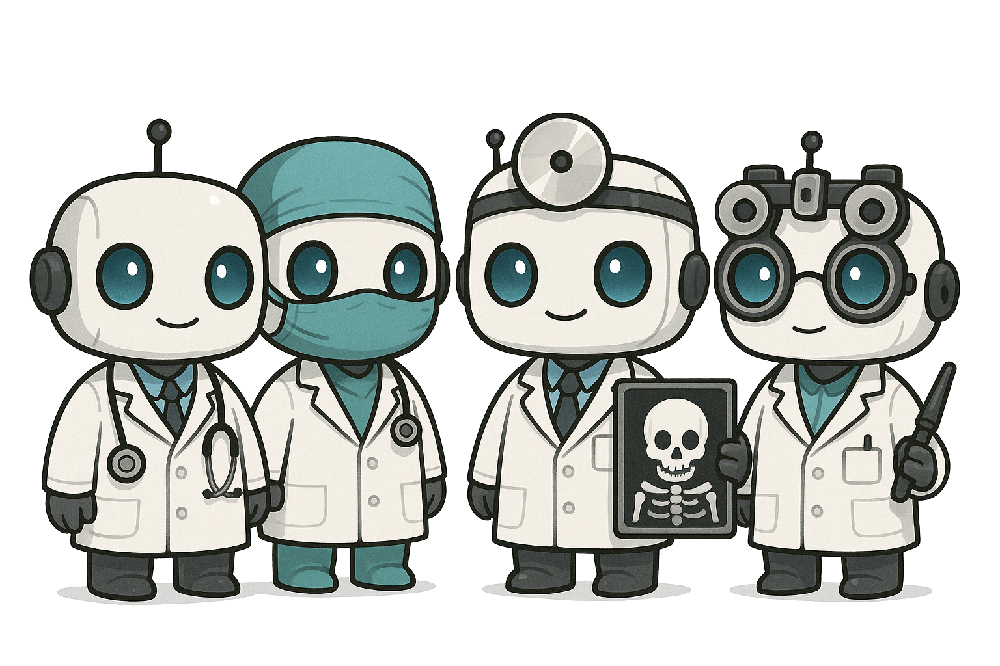
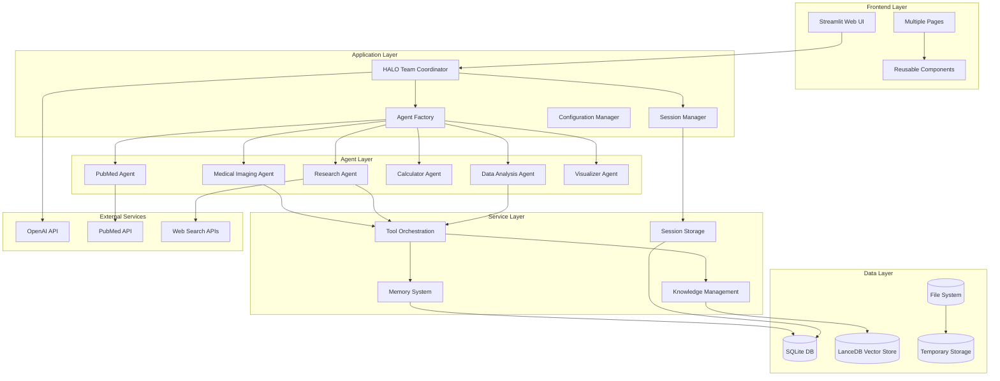
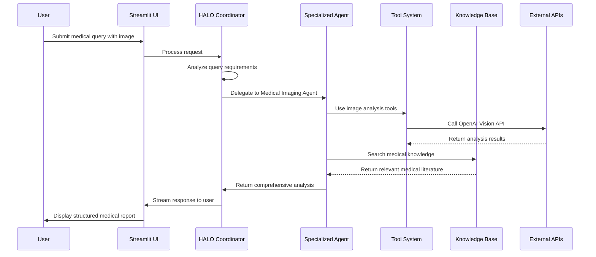
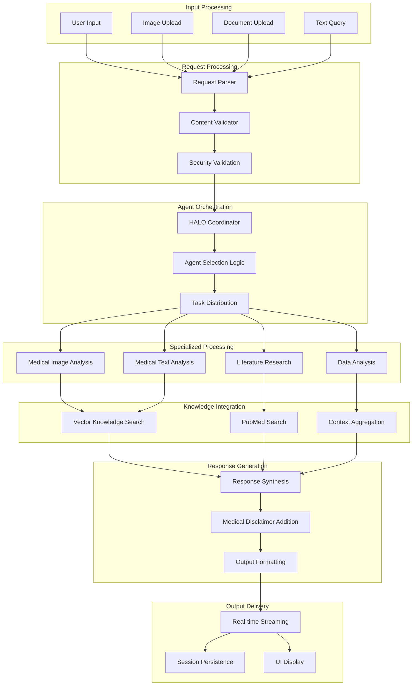
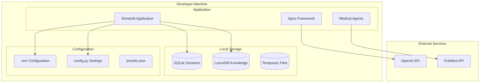
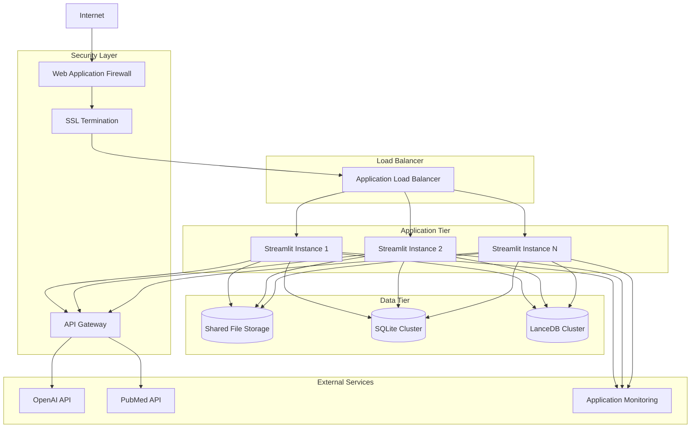

# GodsinWhite - Architecture Decision Records

## Table of Contents

1. [Architecture Decision Records (ADRs)](#architecture-decision-records-adrs)
2. [System Architecture](#system-architecture)
3. [Data Flow Diagrams](#data-flow-diagrams)
4. [Deployment Architecture](#deployment-architecture)
5. [Implementation Guidelines](#implementation-guidelines)

## Overview

GodsinWhite is an advanced medical AI platform built on the Agno framework that orchestrates specialized AI agents for medical assistance, diagnostics, image analysis, and research. The architecture uses a multi-agent approach with a HALO (HALO Agent Interface) coordinator.

This document outlines the key architectural decisions, system design, and implementation guidelines for the GodsinWhite platform.

---

## Architecture Decision Records (ADRs)

### ADR-001: Multi-Agent Architecture Pattern

**Status:** Accepted  
**Date:** 2024-08-26  
**Decision Makers:** Development Team

#### Context
Need to create a medical AI system that can handle diverse medical queries requiring different types of expertise (imaging, research, data analysis, etc.).

#### Decision
Implement a multi-agent architecture using the Agno framework with specialized medical agents coordinated by a central HALO (HALO Agent Interface) team.

#### Rationale
- **Specialization**: Each agent can focus on specific medical domains
- **Scalability**: Easy to add new medical specialties as separate agents
- **Maintainability**: Isolated agent logic reduces complexity
- **Flexibility**: Agents can be combined dynamically based on query requirements

#### Consequences
- **Positive**: Clear separation of concerns, specialized expertise, extensible architecture
- **Negative**: Increased system complexity, inter-agent communication overhead

---

### ADR-002: Streamlit as Frontend Framework

**Status:** Accepted  
**Date:** 2024-08-26  
**Decision Makers:** Development Team

#### Context
Need a rapid development framework for creating an interactive medical AI interface with real-time streaming capabilities.

#### Decision
Use Streamlit as the primary frontend framework for the web application.

#### Rationale
- **Rapid Development**: Python-native, minimal boilerplate code
- **Real-time Streaming**: Native support for streaming responses
- **Medical UI Components**: Easy integration of medical imaging displays
- **Deployment**: Simple cloud deployment options

#### Consequences
- **Positive**: Fast development cycle, Python ecosystem integration, built-in state management
- **Negative**: Limited customization compared to React/Vue, Python-only ecosystem

---

### ADR-003: SQLite + LanceDB Hybrid Storage

**Status:** Accepted  
**Date:** 2024-08-26  
**Decision Makers:** Development Team

#### Context
Need efficient storage for both structured session data and unstructured medical knowledge with vector search capabilities.

#### Decision
Implement hybrid storage using SQLite for session management and LanceDB for vector-based knowledge storage.

#### Rationale
- **SQLite**: Lightweight, serverless, ACID compliance for sessions
- **LanceDB**: Vector search capabilities for medical knowledge retrieval
- **Hybrid Approach**: Optimal performance for different data types
- **Local Deployment**: No external database dependencies

#### Consequences
- **Positive**: No external database setup, optimal query performance, vector search capabilities
- **Negative**: Limited to single-node deployment, manual backup procedures

---

### ADR-004: OpenAI GPT-4o as Primary Model

**Status:** Accepted  
**Date:** 2024-08-26  
**Decision Makers:** Development Team

#### Context
Need a high-performance multimodal AI model capable of medical image analysis and text generation.

#### Decision
Use OpenAI GPT-4o as the primary model with support for alternative models (Claude, Gemini).

#### Rationale
- **Multimodal**: Native support for image and text processing
- **Medical Performance**: Strong performance on medical reasoning tasks
- **API Stability**: Reliable API with good documentation
- **Flexibility**: Model abstraction allows easy switching

#### Consequences
- **Positive**: High-quality medical analysis, multimodal capabilities, reliable service
- **Negative**: API costs, dependency on external service, rate limiting

---

### ADR-005: Factory Pattern for Agent Creation

**Status:** Accepted  
**Date:** 2024-08-26  
**Decision Makers:** Development Team

#### Context
Need consistent, maintainable way to create and configure medical agents with proper dependency injection.

#### Decision
Implement factory pattern for agent creation with dynamic discovery and configuration.

#### Rationale
- **Consistency**: Standardized agent creation process
- **Dependency Injection**: Proper model, memory, and knowledge injection
- **Dynamic Discovery**: Automatic agent registration and discovery
- **Configuration**: Centralized agent configuration management

#### Consequences
- **Positive**: Consistent agent interfaces, easy testing, maintainable code
- **Negative**: Additional abstraction layer, learning curve for new developers

---

### ADR-006: Medical Disclaimer and Compliance

**Status:** Accepted  
**Date:** 2024-08-26  
**Decision Makers:** Development Team, Legal Team

#### Context
Medical AI system requires appropriate disclaimers and compliance measures to ensure responsible use.

#### Decision
Implement comprehensive medical disclaimers and educational-use-only positioning.

#### Rationale
- **Legal Protection**: Clear disclaimers about educational/demonstration use
- **Ethical AI**: Responsible AI deployment in medical domain
- **User Safety**: Clear guidance about professional medical consultation
- **Compliance**: Alignment with medical AI best practices

#### Consequences
- **Positive**: Legal protection, ethical deployment, user safety
- **Negative**: Limited commercial medical applications, user experience friction

---

### ADR-007: Agno Framework Compatibility

**Status:** Accepted  
**Date:** 2024-09-15  
**Decision Makers:** Development Team

#### Context
The application was initially built with an older version of the Agno framework (v2) but needed to be updated to work with the current version, which has significant API changes.

#### Decision
Refactor the codebase to align with the current Agno framework API, focusing on session management, response streaming, and database access patterns.

#### Rationale
- **API Evolution**: The Agno framework has evolved with breaking changes
- **Session Management**: New session handling mechanisms in current Agno version
- **Streaming Responses**: Changes in async generator patterns for streaming
- **Database Access**: Storage attribute renamed to db in newer versions
- **Future Compatibility**: Ensure ongoing compatibility with framework updates

#### Consequences
- **Positive**: Full compatibility with current Agno framework, improved performance, better error handling
- **Negative**: Required significant refactoring of session management code, temporary regression in some features

---

### ADR-008: Dark Theme UI Implementation

**Status:** Accepted  
**Date:** 2024-09-18  
**Decision Makers:** Development Team, UX Team

#### Context
The medical application needed a dark theme option to reduce eye strain during extended use and provide a modern, professional appearance aligned with medical software standards.

#### Decision
Implement a comprehensive dark theme using custom CSS with Streamlit, ensuring consistent styling across all UI elements.

#### Rationale
- **User Experience**: Reduce eye strain during extended medical analysis sessions
- **Professional Appearance**: Align with modern medical software design standards
- **Accessibility**: Improve contrast and readability for various lighting conditions
- **Consistency**: Ensure uniform appearance across all application components
- **Theme Switching**: Allow users to select their preferred theme

#### Consequences
- **Positive**: Improved user experience, professional appearance, better accessibility
- **Negative**: Additional CSS maintenance overhead, potential Streamlit version compatibility issues

---

## System Architecture

### High-Level Architecture

### Agent Interaction Flow

### Data Flow Architecture

## Deployment Architecture

### Local Development Environment

### Production Cloud Deployment

---

## Implementation Guidelines

### Development Workflow

1. **Agent Development**
   - Follow factory pattern for new agents
   - Implement proper error handling and logging
   - Include comprehensive medical disclaimers
   - Test with various medical image formats

2. **UI Development**
   - Use Streamlit components consistently
   - Implement proper session state management
   - Ensure mobile responsiveness
   - Follow accessibility guidelines

3. **Testing Strategy**
   - Unit tests for individual agents
   - Integration tests for agent coordination
   - UI tests for user workflows
   - Performance tests for image processing

4. **Security Considerations**
   - Validate all user inputs
   - Implement proper API key management
   - Ensure HIPAA compliance measures
   - Regular security audits

### Monitoring and Maintenance

1. **Performance Monitoring**
   - Response time tracking
   - Error rate monitoring
   - Resource utilization metrics
   - User session analytics

2. **Medical Content Updates**
   - Regular knowledge base updates
   - Medical literature integration
   - Agent performance evaluation
   - Compliance review cycles

---

## Architectural Summary

The GodsinWhite architecture represents a sophisticated approach to medical AI system design with several key characteristics:

1. **Multi-Agent Orchestration**: The HALO Agent Interface coordinates specialized medical agents, each with distinct capabilities and expertise areas.

2. **Layered Architecture**: Clear separation between frontend, application logic, agent implementation, services, and data storage provides maintainability and flexibility.

3. **Hybrid Storage**: Combination of SQLite for structured data and LanceDB for vector embeddings optimizes for different data access patterns.

4. **Streamlit Integration**: Leverages Streamlit's rapid development capabilities while extending it with custom components and styling.

5. **Agno Framework**: Built on the Agno multi-agent framework with careful attention to version compatibility and API evolution.

6. **Medical Compliance**: Architecture decisions reflect the specialized requirements of medical applications, including disclaimers and ethical considerations.

This architecture provides a solid foundation for continued development and extension of the GodsinWhite platform while maintaining focus on its core medical AI capabilities.

---

**Document Version:** 2.0  
**Last Updated:** September 19, 2025  
**Next Review:** October 19, 2025
